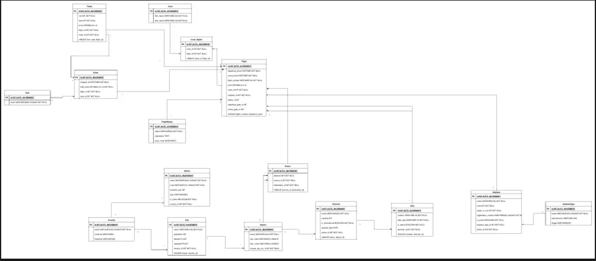

# airport-api-service
superuser cred.:
login: admin@admin.com
pass.: super2025user

user1 cred.
login: user@user.com
pass.: qwert12345

user2 cred
login: user1@user1.com
pass: qwerty123456

DB-structure:
[diagram](https://drive.google.com/file/d/1UuFeLkHRUa-sjs0EkaRc1vUEJ0jKJxuB/view?usp=sharing):
